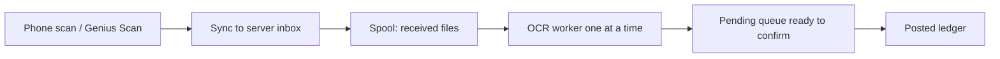

# Mass ingest & async OCR queue

**Tracking:** [#9](https://github.com/githubphadnis/xtav2/issues/9)  
**Status:** design note — implement with mass upload (not in current sync Capture path).

## Problem

Capture today runs **OCR in the HTTP request**. Rapid scanning stacks long Google/Ollama
calls, the UI feels jammed, and Pending mixes “still processing” with “ready to review.”

## Capture (interactive)

Upload returns immediately: image is stored with status ``processing``, OCR runs in
a background task, then the row becomes ``pending`` for confirm. Stuck ``processing``
rows are re-queued on app startup. Rapid scanning no longer blocks the UI on OCR.

## Target mass-ingest flow

1. **Accept fast:** save image (and optional metadata) to a **spool** directory / `ingest_jobs` table; return immediately (“queued”).
2. **Worker:** process one (or few) jobs at a time: OCR → structure → create `pending` expense + line items.
3. **Pending UI:** only show jobs that finished OCR (or show a separate “Processing…” list with count).
4. **Mass folder:** same spool — drop files into e.g. `/data/inbox/receipts/`; worker picks them up.

Capture (single shot) can keep sync OCR for now, or also enqueue for consistency once the worker exists.

## Image resolution (suggestion — evaluate before implementing)

Downscaling before Vision can cut upload size, latency, and cost.

| Upside | Downside / risk |
|--------|------------------|
| Faster upload & OCR | Tiny print (MwSt, prices) may become unreadable |
| Lower Google Vision payload/cost | Genius Scan already optimizes; double-compress can hurt |
| Less disk in `uploads` | Hard to undo if we only keep the small image |

**Do not implement blindly.** If we do it:

- Keep **original** in spool (or a `raw/` subfolder) and OCR a **working copy** (e.g. max edge 1600–2000px, JPEG ~85%).
- A/B a few German receipts before making it default.
- Never downscale so aggressively that line items fail more often than they save time.

## UI implications

- Raise Pending list limit / add paging when backlog is large.
- Badge: distinguish `processing` vs `ready`.
- Optional: bulk confirm later; first version can stay one-by-one confirm.

## Out of scope here

Bank CSV import, receipt↔bank reconcile, security hardening (#14).
